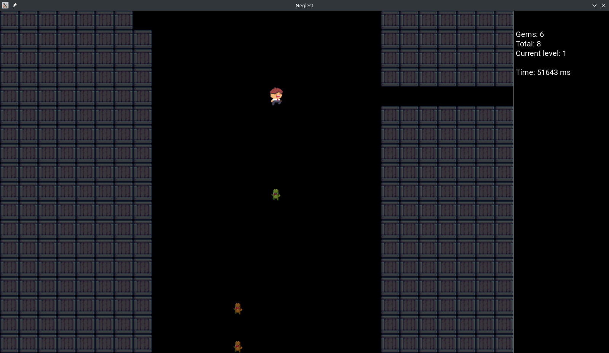

# Neglest - An OpenGL 2D roguelike game

Inspired by the https://github.com/true-grue/DandyBot. 
Player is controlled by an algorithm that can be embedded in the game library. 
The example of that algorithm is presented within the library for demonstration 
and it is the ideal algorithm for this game.

## The project is currently in active development stage

## Screenshots

